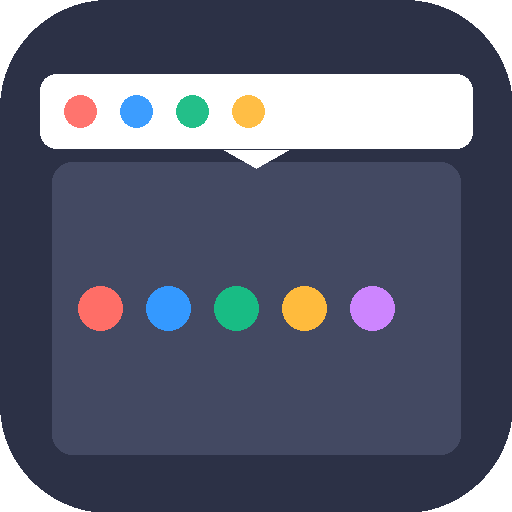
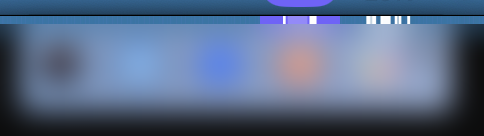
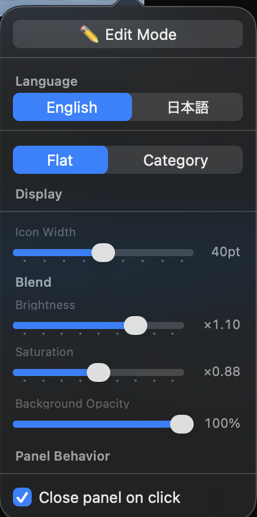
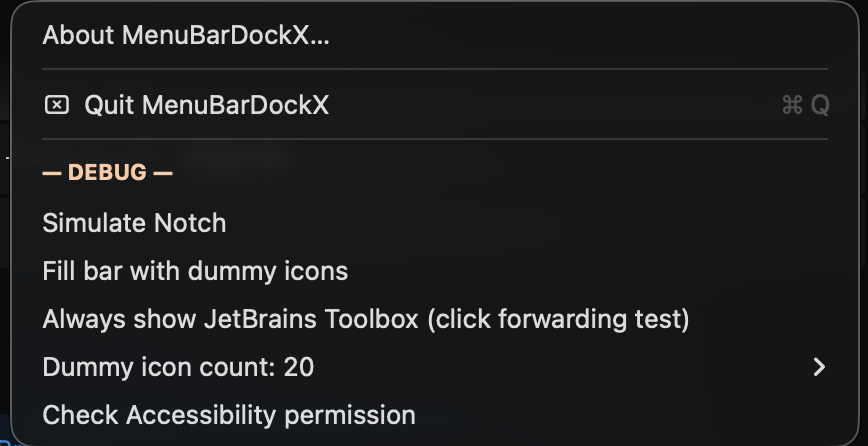
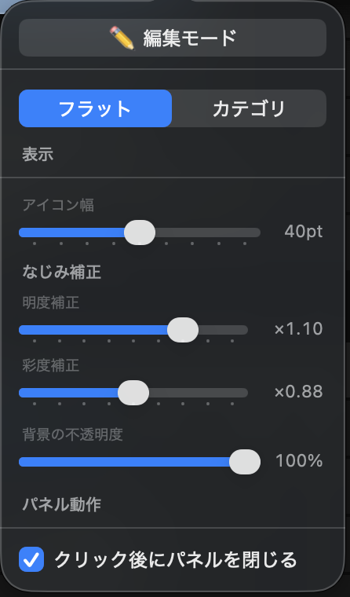
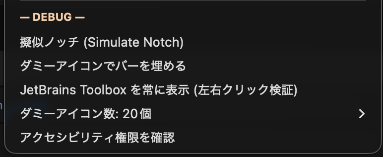

# MenuBarDockX

<p align="center">
  
</p>

<p align="center">
  <strong>Bring your hidden menu bar icons back into view.</strong><br>
  <sub>macOS のメニューバーを、見える場所に取り戻す。</sub>
</p>

<p align="center">
  macOS 14 (Sonoma) or later &nbsp;/&nbsp; Apple Silicon &amp; Intel<br>
  Swift / AppKit / Zero third-party dependencies / Fully local
</p>

<p align="center">
  <a href="../../releases/tag/v1.3.0"></a>
  
  
</p>

---

<!-- ============================================================ -->
<!--  ENGLISH                                                      -->
<!-- ============================================================ -->

## Overview

MenuBarDockX is a macOS menu bar utility that collects icons hidden behind the notch or pushed off-screen and displays them in a floating overflow panel — right below where they disappeared.

No subscription. No telemetry. No external server. Everything runs locally.

> ⚠️ **Experimental / work-in-progress.** MenuBarDockX is an experimental, actively-evolving personal project provided **as is, with no warranty of any kind**. Behavior may change between versions, and bugs are to be expected. Use at your own risk.

---

## Screenshots

| Overflow Panel | Settings Panel | DEBUG Menu (Debug build only) |
|:---:|:---:|:---:|
|  |  |  |
| Background color sampled from the real menu bar | Brightness ×1.10 / Saturation ×0.88 | DEBUG section (hidden in Release builds) |

---

## Why MenuBarDockX?

macOS has no official overflow UI for third-party status icons.[^overflow]

As more apps run in the background, their icons silently vanish off the right edge of the menu bar. On notch-equipped Macs the problem is even worse — icons disappear behind the notch entirely.

"Is my VPN still connected?" "Is the sync agent running?" "Is the security tool active?" —  
**"Out of sight" quietly erodes workflow reliability.**

MenuBarDockX gives a simple answer: **surface every hidden icon in an organized floating panel you can actually see and click.**

---

## Features

| Feature | Description |
|---------|-------------|
| Auto overflow detection | When icons are hidden, the existing app icon automatically switches to ▾ |
| Overflow panel | Left-click ▾ to open the floating panel and interact with icons |
| Dead zone self-detection | Even when the ▾ itself is pushed into the notch, overflow mode stays active |
| Global keyboard shortcut | **⌃⌥⌘M** opens the overflow panel at any time — even when ▾ is not visible |
| Launch at Login | Register as a login item (SMAppService) so MenuBarDockX starts early and grabs a visible slot |
| Left click forwarding | Accurate forwarding via AXPressAction |
| Right click forwarding | Falls back to a quick menu (Toggle / Quit) — CGEvent right-click is intercepted by ControlCenter on macOS Tahoe |
| Menu bar color sampling | Panel background auto-matches the real menu bar color |
| Category tabs | All / System / Development / Cloud / Security / Utility |
| Auto-classification rules | Docker, JetBrains, Dropbox, 1Password, Raycast, and more |
| Edit mode | Drag to reorder, drag to tab to assign category, or right-click to change category |

---

## Known Limitations

| Limitation | Detail |
|-----------|--------|
| Right-click forwarding | On macOS 15 (Sequoia) and later, CGEvent right-clicks sent to menu bar items are intercepted by ControlCenter (window layer 25). MenuBarDockX shows a fallback menu (Toggle / Quit) instead. |
| Multi-widget apps (e.g. Stats) | Apps that place multiple status items for different widgets (CPU, Network, …) all appear with the same app icon. Live per-widget icon updates are not available without Screen Recording permission. Each icon is independently clickable. |
| Icon images | Some apps (particularly system-integrated widgets) expose neither AXImage nor an accessible description, so they appear with the generic app icon rather than their actual status icon. |
| Screen Recording permission | Required for panel background color sampling (`CGWindowListCreateImage`). The app works without it, but the panel background will use a fallback color instead of sampling the real menu bar color. |
| Intel / Sonoma | Functionality on Intel Macs and macOS 14 (Sonoma) has not been formally tested. |

### Overflow indicator behavior

```
← Left (hidden first)                Right (stable) →

Normal:   [hidden icons…] 🔵 🟠 📦  [App icon]  |System|
                                          ↑
                                Left click  → Settings menu
                                Right click → Settings menu

Overflow: [hidden icons…] 🔵 🟠 📦  [   ▾   ]  |System|
                                          ↑
                                Left click  → Overflow panel
                                (use ⌃⌥⌘M if ▾ is also hidden in the notch)
```

> **When ▾ is hidden too:** If MenuBarDockX itself gets pushed into the notch (e.g. because many other apps started before it), the ▾ indicator may not be visible. In that case, use the global keyboard shortcut **⌃⌥⌘M** (Control + Option + Command + M) to open the overflow panel from anywhere. Enabling **Launch at Login** also helps — starting early ensures a visible slot in the menu bar.

---

## Installation

### ⚠️ This is an unsigned build (no code signing / notarization)

MenuBarDockX is a free, open-source personal project distributed as a **plain Release build, without an Apple Developer signature or notarization** (Apple notarization requires the Apple Developer Program at $99/year, which this project does not use). Because of this, **macOS Gatekeeper will warn you on first launch that the developer "cannot be verified."** This warning is expected for unsigned apps distributed outside the Mac App Store — it does not mean the app is unsafe. All source code is public, so you can review or build it yourself.

### Option A — Use a release build

1. Download `MenuBarDockX.app` (packaged as a `.zip` or `.dmg`) from the [Releases](../../releases) page.
2. Move **`MenuBarDockX.app` into your `/Applications` folder**.
3. Double-click it. macOS will block it with: *"MenuBarDockX.app cannot be opened because the developer cannot be verified."* Click **Done** (do **not** click "Move to Trash").
4. Open **System Settings → Privacy & Security**, scroll down to the Security section, and click **"Open Anyway"** next to the MenuBarDockX message.
5. Click **Open** in the final confirmation dialog. From then on it launches normally.

### Option B — Build from source

```bash
git clone https://github.com/suzuki-black/MenuBarDockX.git
cd MenuBarDockX
xcodebuild -project MenuBarDockX.xcodeproj \
           -scheme MenuBarDockX \
           -configuration Release \
           CONFIGURATION_BUILD_DIR=./build/Release
open ./build/Release/MenuBarDockX.app
```

The built app is placed at **`./build/Release/MenuBarDockX.app`**. A build you compiled yourself usually opens without the Gatekeeper warning; a build downloaded from elsewhere still requires steps 3–5 above on first launch.

> **Note:** App Sandbox is disabled because the Accessibility API requires it.  
> All source code is public — you can verify exactly what the app does.

---

## Permissions

| Permission | Purpose | Where to grant |
|-----------|---------|----------------|
| Accessibility | Read and click menu bar items (AXUIElement API) + global shortcut (NSEvent global monitor) | System Settings → Privacy & Security → Accessibility |
| Screen Recording *(some setups)* | Capture icon images and sample background color (CGWindowListCreateImage) | System Settings → Privacy & Security → Screen Recording |

### How to grant Accessibility permission

1. Launch MenuBarDockX (a dialog appears automatically on first launch)
2. Open **System Settings → Privacy & Security → Accessibility**
3. Find **MenuBarDockX** in the list and turn the toggle ON
4. Restart MenuBarDockX

MenuBarDockX **never sends any data externally.**  
There is no networking code — all processing happens on your device.

---

## Usage

### App menu

Left-click the app icon in the menu bar (when in normal mode).

| Item | Description |
|------|-------------|
| About MenuBarDockX… | Shows app name, version, and copyright |
| Launch at Login | Toggle automatic startup at login (SMAppService). A prompt appears on first launch |
| Quit MenuBarDockX | Quit the app (`⌘Q`) |
| — DEBUG — *(Debug builds only)* | See debug features below |

> When overflow mode is active, left-clicking ▾ directly opens the overflow panel. Access the settings menu by right-clicking ▾ instead.

### Global keyboard shortcut

**⌃⌥⌘M** (Control + Option + Command + M) toggles the overflow panel from any app, at any time.

This shortcut works even when the ▾ indicator is hidden in the notch zone — making it the reliable fallback when the menu bar is too crowded to show the indicator. Requires Accessibility permission (already needed for the main functionality).

### Edit Mode

Edit mode lets you reorder icons and assign categories.

**How to enter edit mode:**

1. Left-click **▾** to open the overflow panel
2. Click the **gear icon** (top-right of the panel) to open settings
3. Press the **"Edit Mode" button** at the top of settings (shows "✏️ Editing" when ON)

Press the same button again to exit edit mode.

**Controls in edit mode:**

| Action | Effect |
|--------|--------|
| Drag icon (within icon row) | Reorder icons in the panel |
| Drag icon onto a tab | Assign to that tab's category |
| Right-click icon | Show category selection menu |

**Visual feedback:**

- A white dashed border appears around each icon
- A ghost view and drop indicator appear while dragging
- The target tab highlights when you drag an icon over it
- The gear icon becomes fully opaque to indicate edit mode is active

**Persistence:** Reorder and category changes are saved across restarts  
(`~/Library/Application Support/MenuBarDockX/items.json`)

---

## Settings

Open with the gear button (top-right of the overflow panel).

| Setting | Default | Range | Description |
|---------|---------|-------|-------------|
| Edit Mode | OFF | — | Enables drag reorder and category assignment |
| Display Mode | Flat | Flat / Category | Flat: one row. Category: tabbed view |
| Icon Width | 40 pt | 32–48 pt (2 pt steps) | Width of each icon cell |
| Brightness | ×1.10 | 0.80–1.20 | Background brightness correction |
| Saturation | ×0.88 | 0.70–1.10 | Background saturation correction |
| Background Opacity | 1.0 | 0.0–1.0 | 0.0 = transparent / 1.0 = solid sampled color |
| Close panel on click | ON | — | Auto-close the panel after clicking an icon |

---

## Debug features (Debug build only)

When built in `Debug` configuration, a **orange `— DEBUG —`** section appears in the right-click menu.  
Completely excluded from `Release` builds via `#if DEBUG`.

| Item | Description |
|------|-------------|
| Simulate Notch | Renders a 200 pt virtual notch at screen center |
| Fill bar with dummy icons | Adds dummy NSStatusItems to test overflow behavior |
| Always show JetBrains Toolbox | Forces Toolbox visible to verify click forwarding |
| Dummy icon count (submenu) | Choose 1 / 2 / 3 / 5 / 8 / 10 / 15 / 20 |
| Check Accessibility permission | Reports current permission state; opens System Settings if needed |

---

## Background color engine

The panel background is generated by **real-time sampling of the actual menu bar color**,  
automatically adapting to wallpaper-derived blur, light/dark mode, and menu bar translucency.

```
① CGWindowListCreateImage
   └ Capture the full menu bar width at pixel resolution
        ↓
② Slice the center 1px row
   └ A thin strip spanning full width (~2880px on Retina 2x)
        ↓
③ CIGaussianBlur (radius = 240px)
   └ Smooth horizontally to eliminate rainbow banding
   └ clampedToExtent() prevents darkening at edges
        ↓
④ CIColorControls
   └ brightness ×1.10 / saturation ×0.88
   └ Approximates macOS vibrancy appearance
        ↓
⑤ layer.contentsRect
   └ Display only the horizontal slice matching the panel's X position
   └ Color always matches exactly what is directly above the panel
```

**Re-sampling triggers:**
- Light/Dark mode switch (`NSSystemColorsDidChange`)
- Wallpaper change (`NSWorkspace.activeSpaceDidChangeNotification`)
- Panel shown (`showPanel()`)

---

## Schema migration

Settings stored in UserDefaults are version-checked on launch.  
Users with older settings automatically receive new defaults.

| Version | Change |
|---------|--------|
| v1 | Initial release (`panelOpacity` = blur opacity) |
| v2 | Inverted `panelOpacity` meaning (0.0 = transparent / 1.0 = opaque) |
| v3 | Re-assured v2 migration (handles incomplete migration cases) |
| v4 | Replaced NSVisualEffectView with pure NSView + sampled color. Default `panelOpacity` → 1.0 |
| v5 (current) | Updated `blendBrightness` to 1.10; auto-overwrites existing UserDefaults |

Migration runs once at launch via `DataStore.migrateIfNeeded()`, managed by the `"schemaVersion"` key.

---

## Requirements

| Item | Requirement |
|------|-------------|
| OS | macOS 14 (Sonoma) or later |
| Architecture | Apple Silicon (arm64) / Intel (x86_64) |
| Permission | Accessibility (prompted on first launch) |

> **Tested on:** macOS 15 (Sequoia) and macOS 26 (Tahoe) / Apple Silicon (notch model)  
> Intel Mac / macOS 14 (Sonoma) have not been formally tested.

---

## For developers

### Build configuration

| Item | Detail |
|------|--------|
| Language | Swift 5 |
| UI framework | AppKit (no SwiftUI in runtime UI) |
| Minimum OS | macOS 14.0 |
| Third-party dependencies | None |
| App Sandbox | Disabled (required for AX API) |

### Documentation (Japanese)

| Document | Contents |
|----------|----------|
| [`docs/設計書.md`](docs/設計書.md) | Architecture, module responsibilities, data flow, key algorithms (notch detection, hidden-item judgement, panel positioning) |
| [`docs/取扱説明書.md`](docs/取扱説明書.md) | End-user manual: installation, permissions, daily use, shortcut, settings, troubleshooting |

### File responsibilities

| File | Role |
|------|------|
| `AppDelegate.swift` | App launch, NSStatusItem management, icon-swap (normal ↔ ▾), menu construction |
| `DataStore.swift` | UserDefaults persistence, schema migration (`migrateIfNeeded`) |
| `OverflowUI.swift` | Overflow detection, panel UI, edit mode, background color sampling (`MenuBarGradientSampler`) |
| `GlobalShortcutManager.swift` | Global keyboard shortcut ⌃⌥⌘M via `NSEvent.addGlobalMonitorForEvents` |
| `LoginItemManager.swift` | Login item registration / removal via `SMAppService` |
| `DebugMenuManager.swift` | Debug menu, simulated notch, dummy icons (`#if DEBUG`) |
| `MenuBarEnumerator.swift` | Menu bar item enumeration via AX API (right-edge based hidden detection) |
| `EnvironmentChecker.swift` | Accessibility permission check and report |
| `ClassificationRulesManager.swift` | Auto-classification: maps bundle ID → category via `classification_rules.json` |
| `Category.swift` | Category definitions and preset UUIDs |
| `MenuBarItem.swift` | Menu bar item model and DTO |

### OSS design principles

- **Fully local** — No servers, no telemetry, no accounts required
- **Verifiable** — All code is public, including why App Sandbox is disabled
- **Extensible** — Classification rules are designed to be added via JSON
- **Apple APIs only** — Zero third-party library dependencies

---

## Roadmap

### Near-term (planned)

- [x] Verified on notch-equipped Mac (macOS 15 / Apple Silicon)
- [x] Menu bar color sampling for panel background (blur + brightness/saturation)
- [x] Edit mode (drag reorder, drag-to-tab category assignment, right-click category change)
- [x] Category persistence across restarts
- [x] v1.0.0 stable release
- [x] Bilingual README (English + Japanese)
- [x] v1.1.0: right-click fallback menu, app-quit detection, multi-widget support, panel reopen fix
- [x] v1.2.0: notch edge margin fix (icons just outside rightEdgeX now detected), debug log cleanup, dead code removal
- [x] v1.3.0: icon-swap indicator (▾ replaces normal icon), dead zone self-detection, ⌃⌥⌘M shortcut, Launch at Login, duplicate icon fix
- [ ] Verified on Intel Mac / macOS 14 (Sonoma)
- [ ] Code Signing / Notarization
- [ ] DMG installer release

### Ideas (not committed)

- Usage-frequency-based auto sorting
- "Focus category" mode (work context switching)
- Read-only mode (status monitoring without interaction)
- Machine-learned auto-classification

---

## Release Notes

### v1.3.0 — Icon-swap indicator, dead zone detection & shortcut

**Icon-swap indicator (new)**
- The existing MenuBarDockX NSStatusItem icon now switches to ▾ when hidden icons are detected, instead of inserting a separate indicator item. This avoids the "indicator pushed into dead zone" problem that occurred with a dedicated NSStatusItem.
- When overflow clears, the icon reverts to the normal app icon automatically.

**Dead zone self-detection (new)**
- When the ▾ indicator itself is pushed into the notch zone (e.g. because many apps started before MenuBarDockX), overflow mode now stays active. Previously, this scenario could silently leave hidden icons unreachable.

**Global keyboard shortcut ⌃⌥⌘M (new)**
- `Control + Option + Command + M` opens/closes the overflow panel from any app at any time.
- Works even when ▾ is not visible in the menu bar. Requires Accessibility permission (already needed for the main functionality).

**Launch at Login (new)**
- On first launch, MenuBarDockX prompts whether to register as a login item.
- Uses `SMAppService.mainApp` (macOS 13+); visible in **System Settings → General → Login Items**.
- Starting before other menu bar apps ensures a slot in the visible zone on Sequoia / Tahoe.

**Duplicate icon fix (new)**
- Hidden icon detection now uses the **right edge** of each icon (`pos.x + width < notchRightEdge`) instead of the left edge with a +40 pt margin.
- Fixes the bug where icons straddling the notch boundary (left side hidden, right side visible) appeared in both the visible menu bar and the overflow panel simultaneously.

**Auto-classification activated**
- The bundled classification rules (`classification_rules.json`) are now actually applied: a newly discovered icon with no saved category is auto-assigned to a preset category (Development / Cloud / Security / Utility …) by bundle ID. Previously the rules were shipped but never invoked.

**Login menu clarity fix**
- The "Launch at Login" menu item now uses a fixed title with a checkmark for state, instead of a contradictory "Disable Launch at Login" + checkmark combination.

**Project & quality**
- Added a unit test target (`MenuBarDockXTests`, 28 tests) covering the pure-logic layer (settings codec, DTO round-trip, classification matching, category presets, language switching).
- Removed dead code: the unused `enumerate()` query path, `findWindowID`, `processImage`, and the obsolete `OverflowStateModel` (a leftover from the removed SwiftUI MenuBarExtra approach).
- Cleaned orphaned references in the Xcode project and added Japanese design / user documentation under `docs/`.

---

### v1.2.0 — Notch detection improvement & code cleanup

**Notch edge detection fix**
- Icons placed just outside `NotchDetector.rightEdgeX` (e.g. Pixellenz at x=853 vs rightEdgeX=848) were incorrectly classified as visible even though they were physically occluded by the camera housing.
- Added a +40 pt margin to `isInNotchZone` so icons within 40 pt of the notch right edge are treated as hidden.

**Debug log removed from Release builds**
- `enumerateHiddenItems` and `enumerate` were writing AX enumeration data (app names, bundle IDs, positions) to `/tmp/mbdx_hidden.log` and `/tmp/mbdx_items.log` on every poll cycle in Release builds.
- Both writes are now guarded by `#if DEBUG`.

**Dead code removed**
- `synthesizeRightClick(on:)` — CGEvent right-click synthesis approach that was evaluated and rejected in favor of the fallback menu. Removed.
- `averagedColorImage(from:)` — unused alternative color-sampling implementation. Removed.

---

### v1.1.0 — Bug fixes & stability

**Right-click fallback menu (new)**
- On macOS 15 (Sequoia) and later, ControlCenter intercepts CGEvent right-clicks targeting menu bar items. A fallback menu (Toggle / Quit) is now shown instead.

**Improved app-quit detection**
- Icons are now removed from the panel immediately when the source app terminates.
- Fixes the bug where icons persisted after the app quit.

**Multi-widget app support**
- Apps like Stats that register multiple status items (CPU, Network, …) are now correctly enumerated as separate icons.
- Fixes the deduplication bug that collapsed same-app, no-description items into one (`emptyDescCount` index).

**Panel reopen bug fix**
- Fixes a race condition where the overflow panel briefly reopened after the last icon was removed.
- The indicator-restore path is now skipped correctly when the overflow list becomes empty.

**Debug code cleanup**
- Debug file logging in `AppDelegate.swift` is now fully gated by `#if DEBUG` (no effect on Release builds).

---

### v1.0.0 — Initial stable release

See the [GitHub Releases](../../releases/tag/v1.0.0) page.

---

## Issues / Feedback

Bug reports and feature requests are welcome via [Issues](../../issues).  
Please include your macOS version and Mac model.

---

## License

[MIT License](LICENSE)  
Copyright © 2026 suzuki-black

---

## Disclaimer

MenuBarDockX is an independent, unofficial project. It is **not affiliated with, endorsed by, or sponsored by Apple Inc.** "macOS", "Mac", "Dock", "Finder", "Control Center", and other Apple product names are trademarks of Apple Inc., used here for identification and descriptive purposes only.

The software is provided "as is", without warranty of any kind, and the authors accept no liability for any damages arising from its use. See [LICENSE](LICENSE) for the full terms.

---

<!-- ============================================================ -->
<!--  日本語                                                       -->
<!-- ============================================================ -->

<br>

---

<p align="center"><strong>— 日本語 —</strong></p>

---

## 概要

MenuBarDockX は、ノッチに隠れたり画面外に押し出されたメニューバーアイコンを収集し、フローティングパネルに表示する macOS ユーティリティです。

サブスクリプションなし。テレメトリなし。外部サーバーなし。すべてローカルで完結します。

> ⚠️ **実験的・開発途上のツールです。** MenuBarDockX は個人が開発を続けている実験的なプロジェクトであり、**現状有姿（as is）・無保証**で提供されます。バージョン間で挙動が変わることがあり、不具合が含まれる可能性があります。ご利用は自己責任でお願いします。

---

## スクリーンショット

| オーバーフローパネル | 設定パネル | DEBUG メニュー（Debug ビルドのみ）|
|:---:|:---:|:---:|
|  |  |  |
| メニューバーと色が一致した背景 | 明度 ×1.10 / 彩度 ×0.88 | DEBUG セクション（Release では非表示）|

---

## なぜ MenuBarDockX が必要なのか

macOS には、メニューバーに収まりきらないサードパーティ製アイコンを一覧・操作できる  
**公式のオーバーフロー UI が存在しない。**[^overflow]

常駐アプリが増えるにつれて、アイコンは右端から黙って消えていく。  
ノッチ搭載 Mac ではその傾向がさらに顕著で、アイコンは画面の裏に隠れる。

「VPN が切れていないか」「同期エージェントが動いているか」「セキュリティツールが有効か」——  
**見えない＝動いていない、という誤解がワークフローを静かに壊す。**

MenuBarDockX はこの問題に対してひとつのシンプルな答えを出す：  
**隠れたメニューバーアイコンを、フローティングパネルに整理して表示・操作できるようにする。**

---

## 主な機能

| 機能 | 説明 |
|------|------|
| オーバーフロー自動検出 | 隠れたアイコンを検出すると既存のアプリアイコンが自動で ▾ に切り替わる |
| オーバーフローパネル | ▾ 左クリックでフローティングパネルを表示・操作 |
| dead zone 自己検出 | ▾ 自身がノッチに押し込まれた場合もオーバーフローモードを維持 |
| グローバルキーボードショートカット | **⌃⌥⌘M** でいつでも・どのアプリからでもパネルを開ける（▾ が見えない場合も有効）|
| ログイン時自動起動 | SMAppService でログイン項目に登録し、起動を最優先にして可視スロットを確保 |
| 左クリック転送 | AXPressAction で正確に転送 |
| 右クリック転送 | macOS Tahoe 以降では ControlCenter が CGEvent 右クリックを横取りするため、簡易メニュー（Toggle / Quit）で代替 |
| メニューバー色サンプリング | パネル背景をメニューバーの実際の色に自動追従させる |
| カテゴリ表示 | すべて / システム / 開発 / クラウド / セキュリティ / ユーティリティでタブ分け |
| 自動分類ルール | Docker / JetBrains / Dropbox / 1Password / Raycast など主要アプリを自動分類 |
| 編集モード | パネル内でアイコンをドラッグして並び替え、タブへドラッグまたは右クリックでカテゴリを変更 |

---

## 既知の制限

| 制限事項 | 詳細 |
|---------|------|
| 右クリック転送 | macOS 15 (Sequoia) 以降では、ControlCenter（ウィンドウレイヤー 25）が CGEvent 右クリックを横取りします。MenuBarDockX は代わりに簡易メニュー（Toggle / Quit）を表示します。 |
| 複数ウィジェットを持つアプリ（Stats など）| CPU・ネットワークなど複数のステータスアイテムを登録するアプリは、すべて同じアプリアイコンで表示されます。画面収録権限なしではウィジェットごとのリアルタイムアイコン更新には非対応です。各アイコンは個別にクリック可能です。 |
| アイコン画像 | 一部のアプリ（特にシステム統合ウィジェット）は AXImage もアクセシブルな説明も公開しないため、実際のステータスアイコンではなく汎用のアプリアイコンが表示されます。 |
| 画面収録権限 | パネル背景色のサンプリング（`CGWindowListCreateImage`）に必要です。許可しなくてもアプリは動作しますが、パネル背景はメニューバーの実際の色ではなくフォールバック色になります。 |
| Intel / Sonoma | Intel Mac および macOS 14 (Sonoma) での動作確認は未実施です。 |

### オーバーフローインジケーターの動作

```
← 左（隠れやすい）              右（安定）→

通常時:  [隠れたアイコン…] 🔵 🟠 📦  [アプリアイコン]  |システム|
                                              ↑
                                    左右クリック → 設定メニュー

溢れ時:  [隠れたアイコン…] 🔵 🟠 📦  [    ▾    ]  |システム|
                                              ↑
                                    左クリック  → オーバーフローパネル
                                    （▾ がノッチ内にある場合は ⌃⌥⌘M を使用）
```

> **▾ 自体が隠れているとき:** MenuBarDockX 自身がノッチに押し出された場合（他のアプリが先に起動してスロットを埋めた場合など）、▾ が見えないことがあります。その場合はグローバルショートカット **⌃⌥⌘M**（Control + Option + Command + M）でパネルを開いてください。**ログイン時自動起動**を有効にすると起動順が最優先になり、可視スロットを確保しやすくなります。

---

## インストール

### ⚠️ これは署名なしビルドです（コードサイニング／ノータリゼーションなし）

MenuBarDockX は無料・オープンソースの個人開発プロジェクトで、**Apple Developer 署名やノータリゼーション（公証）を行っていない、素の Release ビルド** として配布されます（公証には年 $99 の Apple Developer Program が必要で、本プロジェクトでは利用していません）。このため **初回起動時に macOS の Gatekeeper が「開発元を確認できません」という警告を表示します。** これは Mac App Store 外で配布される署名なしアプリでは正常な挙動で、アプリが危険であることを意味しません。ソースコードはすべて公開しているので、自分で確認・ビルドすることもできます。

### 方法A — リリースビルドを使う

1. [Releases](../../releases) ページから `MenuBarDockX.app`（`.zip` または `.dmg` で同梱）をダウンロードします。
2. **`MenuBarDockX.app` を `/アプリケーション`（Applications）フォルダへ移動**します。
3. ダブルクリックします。macOS が *「MenuBarDockX.app は、開発元を確認できないため開けません。」* とブロックします。**「完了」**をクリックしてください（**「ゴミ箱に入れる」は選ばない**）。
4. **システム設定 → プライバシーとセキュリティ** を開き、下にスクロールしてセキュリティ欄の MenuBarDockX のメッセージ横にある **「このまま開く」** をクリックします。
5. 最後の確認ダイアログで **「開く」** をクリックします。以降は通常どおり起動します。

### 方法B — ソースからビルドする

```bash
git clone https://github.com/suzuki-black/MenuBarDockX.git
cd MenuBarDockX
xcodebuild -project MenuBarDockX.xcodeproj \
           -scheme MenuBarDockX \
           -configuration Release \
           CONFIGURATION_BUILD_DIR=./build/Release
open ./build/Release/MenuBarDockX.app
```

ビルド成果物は **`./build/Release/MenuBarDockX.app`** に生成されます。自分でコンパイルしたビルドは通常 Gatekeeper の警告なしで開けますが、他所からダウンロードしたビルドは初回起動時に上記 3〜5 の手順が必要です。

> **注意:** アクセシビリティ API を使用するため、App Sandbox は無効化されています。  
> ソースコードはすべて公開されており、何をしているかは自分で確認できます。

---

## 必要な権限

| 権限 | 用途 | 設定場所 |
|------|------|----------|
| アクセシビリティ | メニューバー項目の取得・クリック操作（AXUIElement API）+ グローバルショートカット（NSEvent グローバルモニター）| システム設定 → プライバシーとセキュリティ → アクセシビリティ |
| 画面収録（一部環境）| アイコン画像取得・背景色サンプリング（CGWindowListCreateImage）| システム設定 → プライバシーとセキュリティ → 画面収録 |

### アクセシビリティ権限の許可手順

1. MenuBarDockX を起動する（初回起動時に自動でダイアログが表示される）
2. **システム設定 → プライバシーとセキュリティ → アクセシビリティ** を開く
3. リストに **MenuBarDockX** が表示されていることを確認し、トグルを ON にする
4. MenuBarDockX を再起動する

MenuBarDockX は取得した情報を **一切外部に送信しません。**  
ネットワーク通信コードは存在せず、すべての処理はローカルで完結します。

---

## 使い方

### アプリメニューの構成

通常モード時にアプリアイコンを左クリックすると表示されるメニューです。

| 項目 | 説明 |
|------|------|
| About MenuBarDockX… | アプリ名・バージョン・著作権情報を表示 |
| Launch at Login | ログイン時の自動起動をトグル（SMAppService）。初回起動時にプロンプトが表示される |
| Quit MenuBarDockX | アプリを終了（ショートカット: `⌘Q`）|
| — DEBUG — *(Debug ビルドのみ)* | 以下のデバッグ項目を含む |

> オーバーフローモード中は ▾ の左クリックでパネルが直接開きます。設定メニューは ▾ を右クリックで表示してください。

### グローバルキーボードショートカット

**⌃⌥⌘M**（Control + Option + Command + M）でオーバーフローパネルを開閉できます。

▾ インジケーターがノッチに隠れていても使用でき、メニューバーが混雑している環境での確実な代替手段です。アクセシビリティ権限が必要です（本来の機能にもすでに必要）。

### 編集モード

**編集モードの入り方:**

1. **▾** を左クリックしてオーバーフローパネルを開く
2. パネル右上の **歯車アイコン** をクリックして設定パネルを開く
3. 設定パネル最上部の **「Edit Mode」ボタン** を押す（「✏️ Editing」と表示されれば ON）

編集モードを終了するには、同じボタンをもう一度押します。

**操作方法:**

| 操作 | 効果 |
|------|------|
| アイコンをドラッグ（アイコン行内） | パネル内でアイコンの表示順を並び替え |
| アイコンをタブへドラッグ | ドロップしたタブのカテゴリに割り当て |
| アイコンを右クリック | カテゴリ選択メニューを表示してカテゴリを変更 |

**視覚フィードバック:**

- 各アイコンに白い点線ボーダーが表示されます
- ドラッグ中はゴーストビューとドロップ位置インジケーターが表示されます
- アイコンをタブ上にドラッグすると対象タブがハイライトされます
- 歯車アイコンが完全不透明になり、編集中であることを示します

**永続化:** 並び替えとカテゴリ変更はアプリ終了後も保持されます  
（`~/Library/Application Support/MenuBarDockX/items.json`）

---

## 設定項目一覧

歯車ボタン（パネル右上）から変更できます。

| 設定項目 | デフォルト | 範囲 | 説明 |
|----------|-----------|------|------|
| Edit Mode | OFF | — | ON にするとドラッグ並び替え・カテゴリ変更が可能 |
| Display Mode | Flat | Flat / Category | Flat: 全アイコンを一列表示。Category: タブで分類表示 |
| Icon Width | 40 pt | 32〜48 pt（2 pt 刻み）| アイコンセルの幅 |
| Brightness | ×1.10 | 0.80〜1.20 | 背景色の明度補正 |
| Saturation | ×0.88 | 0.70〜1.10 | 背景色の彩度補正 |
| Background Opacity | 1.0 | 0.0〜1.0 | 0.0=透明 / 1.0=サンプリング色でソリッド表示 |
| Close panel on click | ON | — | アイコンクリック後にパネルを自動で閉じる |

---

## デバッグ機能（Debug ビルド限定）

`Debug` configuration でビルドした場合のみ、右クリックメニューに  
**オレンジ色の `— DEBUG —`** セクションが表示されます。  
`Release` ビルドでは `#if DEBUG` により完全に除外されます。

| デバッグ項目 | 説明 |
|-------------|------|
| Simulate Notch | 画面中央に 200pt 幅の仮想ノッチを表示し、ノッチ搭載環境をシミュレート |
| Fill bar with dummy icons | 指定個数の NSStatusItem を追加してオーバーフロー状態をテスト |
| Always show JetBrains Toolbox | Toolbox を強制表示して左右クリック転送の動作を検証 |
| Dummy icon count（サブメニュー）| 1 / 2 / 3 / 5 / 8 / 10 / 15 / 20 個から選択 |
| Check Accessibility permission | 現在の権限状態を確認。未許可の場合はシステム設定へ誘導 |

---

## オーバーフローパネルの背景色（技術解説）

パネル背景は **メニューバーの実際の色をリアルタイムサンプリング** して再現します。  
壁紙由来の blur 色・ライト/ダークモード・メニューバーの透明度すべてに自動追従します。

```
① CGWindowListCreateImage
   └ メニューバー全幅をピクセル解像度でキャプチャ
        ↓
② 中央 1px 行を切り出し
   └ 幅全体 × 1px の細長い画像（Retina 2x では ~2880px 幅）
        ↓
③ CIGaussianBlur (radius = 240px)
   └ 横方向に平滑化して虹色縞を除去
   └ clampedToExtent() で端部の暗化アーティファクトを防止
        ↓
④ CIColorControls
   └ brightness ×1.10 / saturation ×0.88
        ↓
⑤ layer.contentsRect でスライスを指定
   └ パネルの X 位置に対応する水平スライスのみ表示
```

**自動再サンプリングのトリガー:**
- ライト/ダーク切り替え（`NSSystemColorsDidChange`）
- 壁紙変更（`NSWorkspace.activeSpaceDidChangeNotification`）
- パネル表示時（`showPanel()` 直後）

---

## スキーママイグレーション

UserDefaults の設定値は起動時にバージョンチェックされ、  
古い設定のまま使っているユーザーにも新しいデフォルト値が自動適用されます。

| バージョン | 変更内容 |
|-----------|---------|
| v1 | 初期リリース（`panelOpacity` = blur の不透明度）|
| v2 | `panelOpacity` の意味を反転（0.0=透明 / 1.0=不透明）|
| v3 | v2 移行の再保証（不完全移行ケースへの対処）|
| v4 | NSVisualEffectView を廃止、純 NSView + サンプリング色方式に移行 |
| v5（現在）| `blendBrightness` を 1.10 に更新。既存ユーザーの UserDefaults を自動上書き |

移行は `DataStore.migrateIfNeeded()` が `init()` の直後に 1 回だけ実行します。

---

## 動作環境

| 項目 | 要件 |
|------|------|
| OS | macOS 14 (Sonoma) 以降 |
| アーキテクチャ | Apple Silicon (arm64) / Intel (x86_64) |
| 権限 | アクセシビリティ権限（初回起動時に案内）|

> **動作確認環境:** macOS 15 (Sequoia) および macOS 26 (Tahoe) / Apple Silicon（ノッチ搭載）  
> Intel Mac / macOS 14 (Sonoma) での動作確認は未実施です。

---

## 開発者向け情報

### ビルド構成

| 項目 | 内容 |
|------|------|
| 言語 | Swift 5 |
| UI フレームワーク | AppKit（ランタイム UI に SwiftUI 不使用）|
| 最低 OS | macOS 14.0 |
| サードパーティ依存 | なし |
| App Sandbox | 無効（AX API 使用のため）|

### ドキュメント

| ドキュメント | 内容 |
|-------------|------|
| [`docs/設計書.md`](docs/設計書.md) | アーキテクチャ・モジュール責務・データフロー・主要アルゴリズム（ノッチ検出／隠れ判定／パネル配置） |
| [`docs/取扱説明書.md`](docs/取扱説明書.md) | エンドユーザー向け取扱説明：インストール・権限・日常操作・ショートカット・設定・トラブルシュート |

### ファイル構成と責務

| ファイル | 責務 |
|---------|------|
| `AppDelegate.swift` | アプリ起動・NSStatusItem 管理・アイコン切替（通常 ↔ ▾）・メニュー構築 |
| `DataStore.swift` | UserDefaults 永続化・スキーマ移行（`migrateIfNeeded`）|
| `OverflowUI.swift` | オーバーフロー検出・パネル UI・編集モード・背景色サンプリング（`MenuBarGradientSampler`）|
| `GlobalShortcutManager.swift` | グローバルショートカット ⌃⌥⌘M（`NSEvent.addGlobalMonitorForEvents`）|
| `LoginItemManager.swift` | ログイン項目の登録・解除（`SMAppService`）|
| `DebugMenuManager.swift` | デバッグメニュー・擬似ノッチ・ダミーアイコン管理（`#if DEBUG`）|
| `MenuBarEnumerator.swift` | AX API によるメニューバー項目の列挙（右端基準の隠れ判定）|
| `EnvironmentChecker.swift` | アクセシビリティ権限の確認・レポート表示 |
| `ClassificationRulesManager.swift` | 自動分類：`classification_rules.json` でバンドル ID → カテゴリを解決 |
| `Category.swift` | カテゴリ定義・プリセット UUID |
| `MenuBarItem.swift` | メニューバー項目モデル・DTO |

### OSS としての設計方針

- **ローカル完結** — サーバ依存なし、テレメトリなし、アカウント不要
- **検証可能** — App Sandbox 無効の理由を含め、すべてのコードを公開
- **拡張可能** — 分類ルールを JSON で追加できる設計
- **Apple 純正 API のみ** — サードパーティライブラリへの依存ゼロ

---

## ロードマップ

### 近い将来（予定）

- [x] ノッチ搭載 Mac での実機検証（macOS 15 / Apple Silicon で確認済み）
- [x] オーバーフローパネル背景のメニューバー色サンプリング（blur + 明度/彩度補正）
- [x] 編集モード（ドラッグ並び替え・タブへのドラッグ＆ドロップでカテゴリ変更・右クリックカテゴリ変更）
- [x] カテゴリ設定の再起動後永続化
- [x] v1.0.0 安定版リリース
- [x] 英日二言語 README
- [x] v1.1.0: 右クリック簡易メニュー・アプリ終了検出・複数ウィジェット対応・パネル再表示修正
- [x] v1.2.0: ノッチ右端マージン修正・デバッグログ整理・デッドコード削除
- [x] v1.3.0: アイコン切替式インジケーター（▾）・dead zone 自己検出・⌃⌥⌘M ショートカット・ログイン時自動起動・重複アイコン表示の修正
- [ ] Intel Mac / macOS 14 (Sonoma) での動作確認
- [ ] Code Signing / Notarization 対応
- [ ] DMG インストーラ公開

### アイデア段階（実装を約束するものではありません）

- 使用頻度ベースのアイコン自動並び替え
- 一時的な「フォーカスカテゴリ」機能（業務モード切り替え等）
- Read-only モード（操作せず状態確認のみ）
- カテゴリ分類の自動学習

---

## リリースノート

### v1.3.0 — アイコン切替インジケーター・dead zone 検出・ショートカット

**アイコン切替インジケーター（新機能）**
- 隠れたアイコンを検出したとき、既存の MenuBarDockX NSStatusItem のアイコンが ▾ に切り替わるようになりました。専用の NSStatusItem を追加して ▾ を表示する方式から変更。
- これにより「インジケーター自身が dead zone に押し出される」問題を回避します。
- 隠れアイコンがゼロになると通常アイコンに自動復元されます。

**dead zone 自己検出（新機能）**
- ▾ インジケーター自身がノッチゾーンに押し込まれた場合（他のアプリが先に起動してスロットを占有した場合など）も、オーバーフローモードを維持するようになりました。

**グローバルキーボードショートカット ⌃⌥⌘M（新機能）**
- `Control + Option + Command + M` でどのアプリからでもオーバーフローパネルを開閉できます。
- ▾ がメニューバーに表示されていない場合でも使用可能です。アクセシビリティ権限が必要です。

**ログイン時自動起動（新機能）**
- 初回起動時に自動起動の登録を促すダイアログが表示されます。
- `SMAppService.mainApp`（macOS 13+）を使用。**システム設定 → 一般 → ログイン項目** に表示されます。
- Sequoia / Tahoe 環境でメニューバーの可視スロットを確保するために有効です。

**重複アイコン表示の修正（バグ修正）**
- 隠れアイコンの判定をアイコン**左端** + マージンから**右端**（`pos.x + width < notchRightEdge`）基準に変更。
- ノッチをまたぐ位置にあるアイコン（左端は隠れているが右端は可視）が、可視領域とパネルの両方に二重表示されていたバグを修正。

**自動分類の有効化**
- 同梱の分類ルール（`classification_rules.json`）が実際に適用されるようになりました。保存済みカテゴリのない新規アイコンは、バンドル ID からプリセットカテゴリ（開発／クラウド／セキュリティ／ユーティリティ等）へ自動割当されます。従来はルールを同梱しながら一度も呼ばれていませんでした。

**ログインメニューの表記修正**
- 「ログイン時に自動起動」メニュー項目を、固定タイトル＋チェックマークで状態を示す方式に変更。「Disable Launch at Login」+ チェックという矛盾した表記を解消しました。

**プロジェクト・品質**
- ユニットテストターゲット（`MenuBarDockXTests`、28 テスト）を追加。純ロジック層（設定の Codec、DTO 往復、分類照合、カテゴリプリセット、言語切替）を網羅。
- デッドコードを削除：未使用の `enumerate()` 列挙経路、`findWindowID`、`processImage`、廃止済み SwiftUI MenuBarExtra の名残 `OverflowStateModel`。
- Xcode プロジェクトの孤立参照を整理し、日本語の設計書・取扱説明書を `docs/` 配下に追加。

---

### v1.2.0 — ノッチ検出精度向上・コード整理

**ノッチ右端検出の修正**
- `NotchDetector.rightEdgeX` が物理的なカメラ筐体の右端より数ピクセル小さい値を返すことがあり、ノッチ直後に配置されたアイコン（例: Pixellenz が x=853、rightEdgeX=848）が「可視」と誤判定されていた問題を修正。
- `isInNotchZone` 判定に +40pt のマージンを追加し、ノッチ右端から 40pt 以内のアイコンも隠れているとして扱うように変更。

**Release ビルドからデバッグログを除外**
- `enumerateHiddenItems` および `enumerate` がポーリングのたびに AX 情報（アプリ名・バンドル ID・座標）を `/tmp/mbdx_hidden.log` および `/tmp/mbdx_items.log` へ書き出していた問題を修正。
- 両方の書き出しを `#if DEBUG` でガードし、Release ビルドには影響しないよう変更。

**デッドコードの削除**
- `synthesizeRightClick(on:)` — CGEvent 右クリック合成（評価の結果、フォールバックメニュー方式を採用したため不要）を削除。
- `averagedColorImage(from:)` — 未使用の代替カラーサンプリング実装を削除。

---

### v1.1.0 — バグ修正・安定性向上

**右クリック簡易メニュー（新機能）**
- macOS 15 (Sequoia) 以降で ControlCenter が CGEvent 右クリックを横取りする問題に対応
- 右クリック時に簡易メニュー（Toggle / Quit）を表示するフォールバックを追加

**アプリ終了検出の改善**
- 監視対象アプリが終了したとき、パネルからアイコンを即時削除するよう変更
- アプリ終了後にアイコンが残り続けるバグを修正

**複数ウィジェットアプリへの対応**
- Stats など複数のステータスアイテムを持つアプリを正しく個別のアイコンとして列挙するよう修正
- 同一アプリ・説明なしの複数ウィジェットが 1 つに集約されていたバグを修正（`emptyDescCount` による重複排除）

**パネル再表示バグの修正**
- 最後のアイコンが消えた後にパネルが再表示されてしまうことがある問題を修正
- インジケーター復元ロジックが空のオーバーフロー状態で誤作動しないよう修正

**デバッグコードの整理**
- `AppDelegate.swift` のデバッグログ書き込みを `#if DEBUG` で完全に除外（Release ビルドへの影響を排除）

---

### v1.0.0 — 最初の安定版リリース

> **[GitHub Releases](../../releases/tag/v1.0.0)** からダウンロード可能（配布準備中）

**ランチャー機能の廃止とオーバーフローパネルへの統合**
- 独立したランチャーウィンドウ（480×480pt）を廃止
- ランチャー関連の 6 ファイルを削除、アイコン並び替え・カテゴリ変更をオーバーフローパネル内の編集モードに統合

**編集モード（新機能）**
- 設定パネルの「✏️ Edit Mode」ボタンで ON/OFF を切り替え
- アイコンのドラッグ並び替え・タブへのドラッグ＆ドロップでカテゴリ割り当て・右クリックカテゴリ変更

**カテゴリ設定の永続化（バグ修正）**
- 再起動後にカテゴリ割り当てが消えていた問題を修正
- `enumerateHiddenItems(merging:)` が保存済み DTO の `categoryID` と `id` を引き継ぐよう変更

**背景色エンジン**
- `CIGaussianBlur` (radius=240px) + 明度/彩度補正でメニューバー色をリアルタイム再現

**インジケーター変更**
- オーバーフローインジケーターを `⟫` から `▾` に変更（パネルが下方向に開くことを明示）

---

## Issue / フィードバック

バグ報告・機能要望は [Issues](../../issues) にてお気軽にどうぞ。  
動作確認環境（OS バージョン・Mac モデル）を添えていただけると助かります。

---

## ライセンス

[MIT License](LICENSE)  
Copyright © 2026 suzuki-black

---

## 免責事項

MenuBarDockX は独立した非公式プロジェクトであり、**Apple Inc. と提携・協賛関係はなく、同社による承認・推奨を受けたものでもありません。**「macOS」「Mac」「Dock」「Finder」「コントロールセンター」その他の Apple 製品名は Apple Inc. の商標であり、本ドキュメントでは識別・説明の目的でのみ使用しています。

本ソフトウェアは現状有姿（as is）・無保証で提供され、利用によって生じたいかなる損害についても作者は責任を負いません。詳細は [LICENSE](LICENSE) をご確認ください。

---

[^overflow]: Control Center is Apple's own control surface for system features (Wi-Fi, Bluetooth, volume, etc.) — it is not an overflow mechanism for third-party status icons. Furthermore, `NSStatusItem.isVisible` returns `true` even when an icon is actually hidden, so there is no official API for apps to detect whether their own icon is visible. See: Jesse Squires — [How to fix Mac menu bar icons hidden by the MacBook notch](https://www.jessesquires.com/blog/2023/12/16/macbook-notch-and-menu-bar-fixes/) / Michael Tsai — [Mac Menu Bar Icons and the Notch](https://mjtsai.com/blog/2023/12/08/mac-menu-bar-icons-and-the-notch/)
